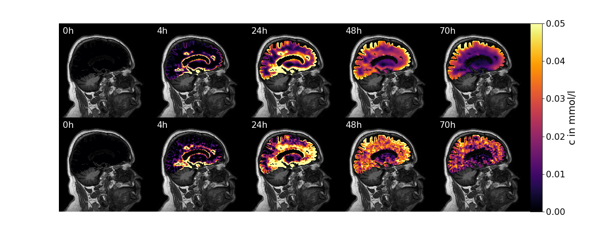
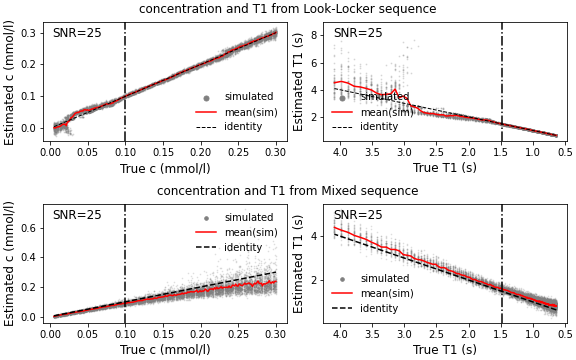

Tracer diffusion in the brain
-------------------------------

We model tracer transport in the brain tissue over 72 hours. The total gadolinium concentration, $c(x, t)$ (amount per brain volume in mmol/l) at position $x$, and time $t \in [0, 259200]$ (in s), satisfies

```math
\begin{subequations}
\begin{align}
    \frac{\partial c}{\partial t} - \mathrm{div}\left( D^{\mathrm{eff}}\nabla c \right)  & = - r \phi^{-1} c, \\
\intertext{subject to the boundary and initial conditions,}
    -D^{\mathrm{eff}}\nabla c \cdot \boldsymbol{n} &= k (\phi^{-1}c - \hat c(x,t)),\\
    c(x, 0) &= 0,
\end{align}
\end{subequations}
```

where $D^\mathrm{eff}$ is the effective diffusion tensor of gadolinium, $r$ is a local clearance rate due to tracer clearance to blood, $k$ is the brain surface conductivity and $\hat c (x,t)$ is the solute concentration in the cerebrospinal fluid just outside of the pial surface of the brain, and $\phi$ is the extra-cellular volume fraction of the brain tissue which is occupied by interstitial fluid. We assume that only the extra-cellular space is accessible to the tracer. Dividing the total concentration by $\phi$ computes the concentration per interstitial fluid volume.

We take the values for $D^\mathrm{eff}$ and $\hat{c}(x,t)$ directly from the provided data set.
A comparison of the simulation field $c(x,t)$ and the corresponding field provided in the data set at 5 time points in shown in the figure above.

Software requirements and installation
----------------------------------------

* cmake >= 3.18
* C++17 compliant compiler (e.g g++ >= 8 or clang >= 6)
* pkg-config
* MPI (e.g. openmpi) for parallel execution
* Python 3.10 for postprocessing

Make a new folder (e.g. `dumux`) that will contain all modules.
Inside of this folder, clone this repo.
Folder structure would look like this

```
dumux
└───dumux-braindiffsion-miniapp
```

Then run from the top folder (`dumux`):

* `./dumux-braindiffsion-miniapp/setup.sh`

to download Dune/DuMux dependencies and configure and build the project.
The script takes care of this but if you are manually cloning the dependencies
make sure to use that branch.

After that folder structure will look like this:

```
dumux
├───dumux-braindiffsion-miniapp
│    ├───build-cmake/appl
│    ├───appl
│    ├───CMakeLists.txt
│    ....
├───dune-common
├───dune-geometry
├───dune-grid
├───dune-istl
├───dune-localfunctions
└───dumux
```

Usage
----------

You can compile the application by running

* `cd dumux-braindiffsion-miniapp/build-cmake/app && make braindiffusion`

and run it with

* `mpirun -np 4 ./braindiffusion`

Runtime parameters can be configures via the parameter file `params.input`
that is located in the app folder but also linked to the build folder.

For postprocessing, switch to the folder `dumux-braindiffsion-miniapp`.
Create a Python virtual environment (tested Python version 3.10) and install requirements:

* `python3 -m venv venv`
* `source venv/bin/activate`
* `pip install -r requirements.txt`

Then switch to `dumux-braindiffsion-miniapp/post` and run the postprocessing
scripts to create result visualizations:

* `cd post`
* `python plot.py` (plots concentration in white and gray matter over time)
* `python map_to_mri.py` (maps the concentration field to the MRI reference image, may take a while)
* `python plot_mapped_mri.py` (plots the concentration field on the MRI reference image)


MRI noise estimation in LookLocker sequence and Mixed sequence
----------------------------------------------------------------

The concentration data used as basis for the simulations is estimated from raw MRI data.
The MRI data is subject to noise. In what way noise propagates through the estimation
is estimates in the scripts provided in the `noise` folder.




Other info
----------

There is an app to test the curve fitting algorithm for the boudary data. Build

* `cd dumux-braindiffsion-miniapp/build-cmake/app && make curvefit`
* `./curvefit`
* `cd ../../post && python plot_curvefit.py`

to inspect the results. This is thought to be used for debugging purposes only.
